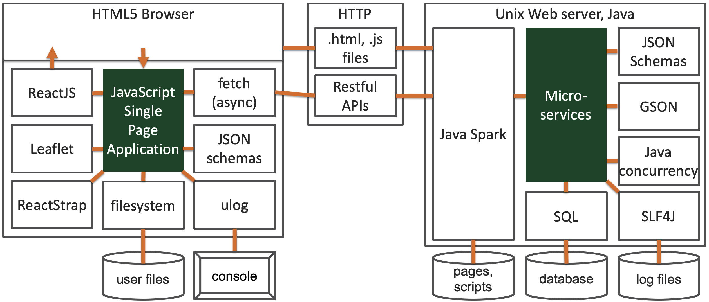
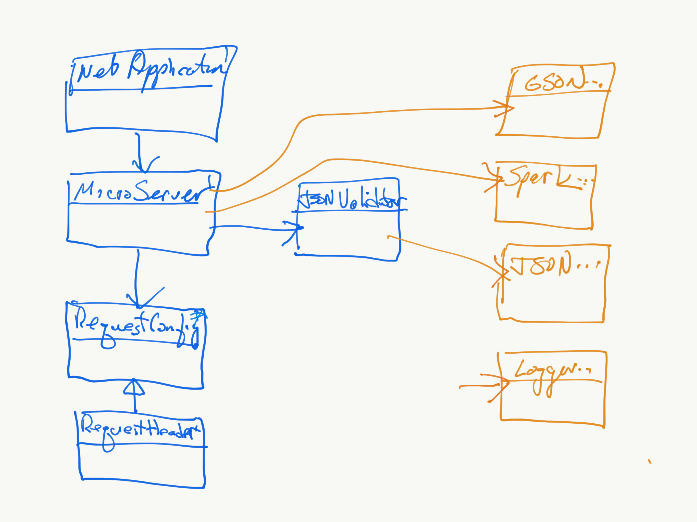
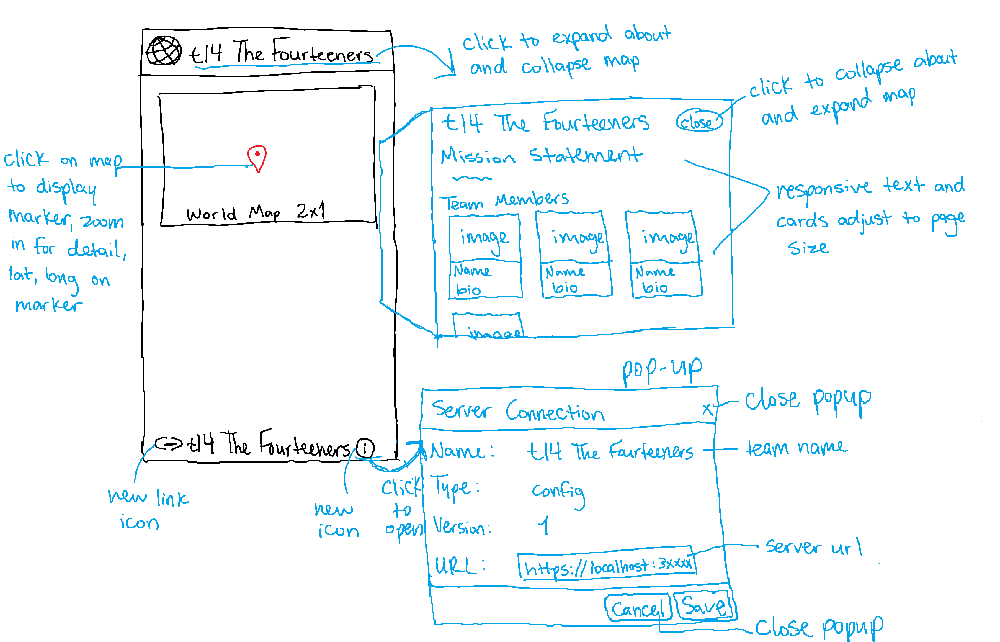
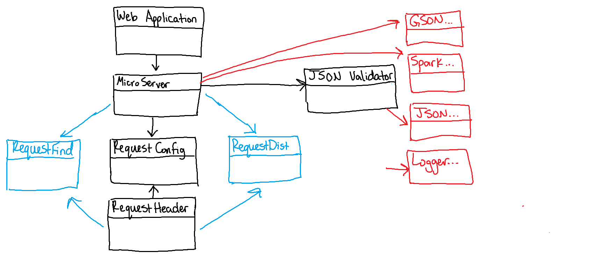
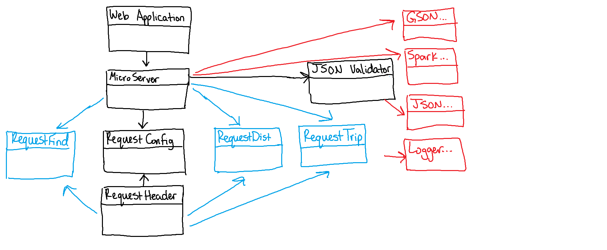
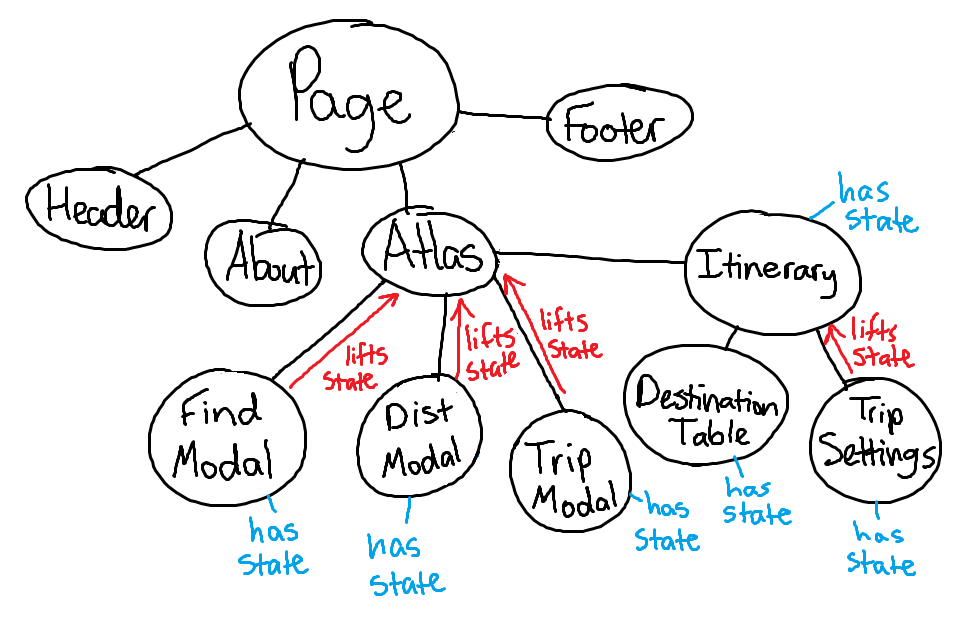
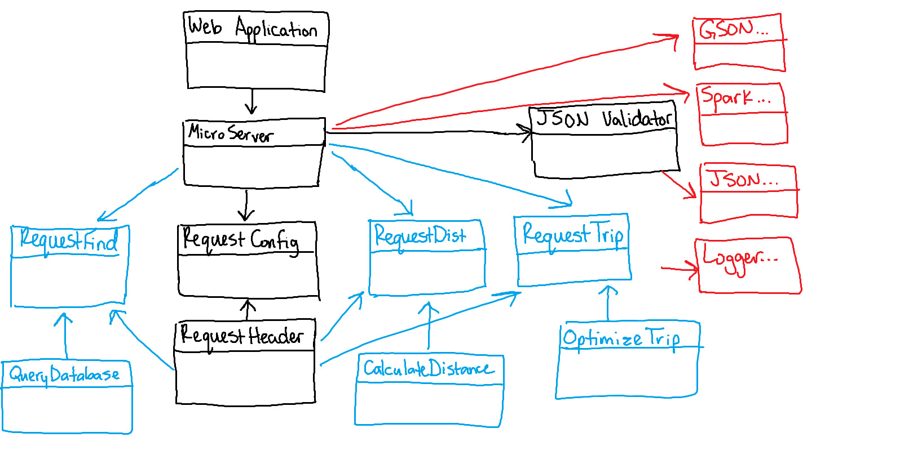
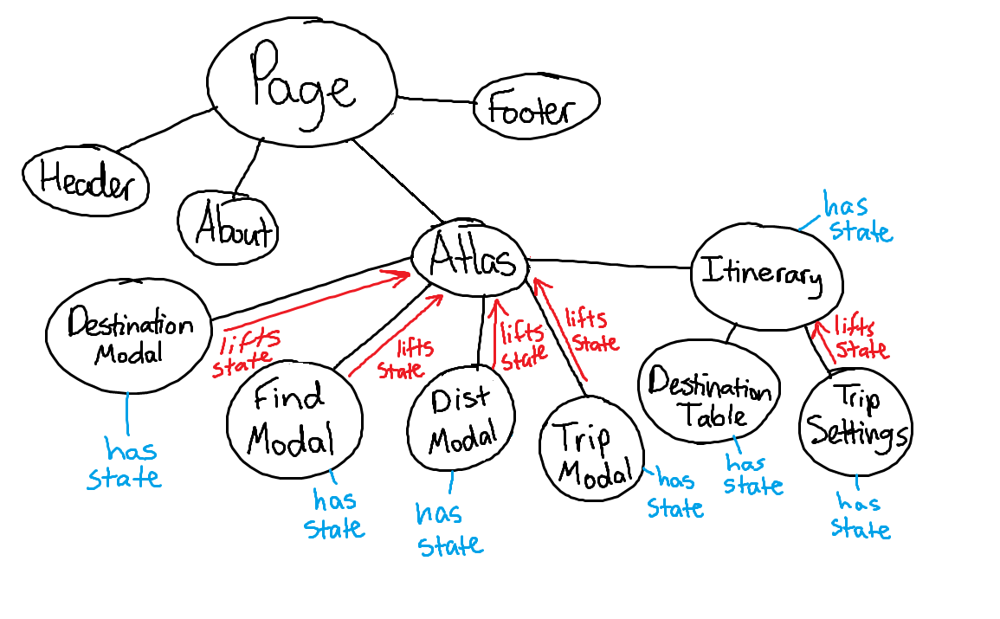

# Introduction

This document describes the architecture and design of a single page web application that interacts with microservices via RESTful APIs.
The key elements in this document include the architecture, user interface, client components, and server classes.

This is a living document that is updated as changes are made each sprint.
The initial document describes the Base code students are given as a starting point for the semester.
Students are expected to update this document as changes are made each sprint to reflect the evolution of their application and key decisions they make.
The Base section serves as an example.

# Base

The Base is a simple application to provide the architecture to the students at the beginning of the semester.
The JavaScript code will be useful examples for students to learn from and leverage in the code they write for sprint 1.
The progressive display of information using collapsible sections and popups will serve as examples of good user interface design.
The overall design is somewhat minimalist/simple for the intended mobile device audience.

### Architecture

The Base architecture is a JavaScript single page web application in an HTML5 browser that uses RESTful APIs to access Micro-services provided by a Java server running on Linux.
The client consists of a minimal index.html file that loads and executes the bundled JavaScript application.
The client and server files are bundled into a single JAR file for execution on the Linux server at a specified port.
The browser fetches the client files from the server on the specified port.

The browser loads the index.html file (by default) which in turn loads the bundled JavaScript single page application bundle.js.
* The single page application makes RESTful API requests to the server on the same port using  JavaScript's asynchronous fetch.  
* A protocol document describes the JSON format for the RESTful API requests and responses.
* JSON Schemas are used to verify requests on the server side and responses on the client side.
* On the client, ReactJS renders the application using ReactStrap, Leaflet, and application defined components.
* GSON is used on the server to convert JSON requests to Java objects and Java objects to JSON responses.
* The client (ulog) and server (SLF4J) logging mechanisms control debugging output during development and production - print statements and console logging should never be used. 

The following architecture elements are not included in the Base system.
They will be added later in the semester.
* Client filesystem .
* Server SQL .
* Server concurrency.

### User Interface

The basic screen in black shows the view on a mobile device, with a header, footer, and map.
The header contains a earth logo and the team name obtained from the server when the client was loaded.
The footer contains a connection icon along with the current server name and server URL the client is connected to.
The blue areas highlight the actions that may be performed.

Rather than buttons or icons to signify actions, we are associating actions with elements that are already on the screen to reduce the clutter.
We are using both popups and collapsible sections in this design rather than choosing to use one exclusively.
* Collapsible/Hidden sections are used for the map and about sections since they have a significant amount of content and we don't need to see them at the same time.
* A popup is used for the URL change since we want to control the interaction until the operation is completed. It seemed more natural than another collapsible section.

#### Clicking on the map places a marker.
Whenever a user clicks on the map, the client should display a marker with latitude and longitude at that location.
We only maintain a single marker at this point displaying the most recently clicked location.

#### Clicking on the team name should tell me more about the team.
Whenever a user clicks the team name in the header, a collapsible section should appear under the header with information about the team.
The collapsible map should disappear so only the about or map are displayed.
A close button / icon in the top right corner of the about will close the about and return the map to display.
A simple toggle in state should be able to control this rendering.
The about page should contain the team name as a heading, but be otherwise blank in base. 

#### Clicking on the URL in the footer should let me change the server.
Whenever a user clicks on the URL a popup should open showing the team name, the URL in an input text box, and a Cancel button.
When the user modifies the URL, a Test button should appear and the server name should disappear.
When the Test button is clicked, it will attempt to connect to the server.
If not successful, nothing changes and the user may continue to make URL changes or click the Cancel button to return to the original sever (it shouldn't change).
If successful, the new server name should appear and a Save button should replace the Test button.
When the user clicks the Save button, the server connection should change and the popup closes, revealing the new servername and URL in the footer.

### Component Hierarchy

The component hierarchy for the base application depicted below shows the our top level App component with four children components.
* App renders the major components on the screen.
* Header renders an icon and a team name in the top banner.
* Footer renders the current server connection in the bottom footer.
* Atlas renders a map.
* About renders information about the team.

We do not show the many ReactStrap components in this hierarchy, even though they will appear when you are debugging on the client.

### Class Diagram
The class diagram for the base application depicted below shows the basic structure of the web server application.

The classes in blue represent the classes specific to this application.  
* WebApplication processes command line parameters and creates MicroServer.
* MicroServer start a web server on the given port, configures the server for security, static files, and APIs for different types of requests, and processes the requests as they arrive.
* JSONValidator verifies a request is properly formatted before attempting to process it using JSON Schemas.
* RequestConfig is a specific request that allows the server to respond with its configuration to allow interoperability between clients and servers. 
* RequestHeader defines the basic components of all requests.

The classes in orange represent the external libraries used by the application.
Often there are several related classes but we've listed only one to simplify the diagram.
* GSON converts a JSON string into a Java object instance.
* Spark provides the necessary web support for our MicroServer.
* JSON provides libraries to manipulate JSON objects using the JSON Schema libraries.
* Logger provides a centralized logging facility used in all of the application classes.

# Sprint 1

* The user interface now has the team name, a mission statement, team member names, information about the team members, and their images on the about page.
* The user interface has the team name in the header and footer.
* The user interface has a new icon for the url and the status icon.
* The user interface has a popup that shows the server settings with labels name, type, version, and url.

# Sprint 2
### User Interface

.png)

Changes made to the UI include two new components which are the Where am I and Find Distance. 

* Where Am I Component: Button, that when clicked, recenters the map back to the user’s current location marker.

* Find Distance Component: Open an input field when clicked, which will have text entries for the latitude and longitude of both locations and a submit button which, when pressed, will reveal the distance and then display markers for both locations with a line between them.

### Component Hierarchy

.png)

Modifications to the component hierarchy were made that integrate new functionality. A component was made for the Find Distance inside of the Atlas Class. This allows the user to input coordinates or locations, which updates the Leaflet map in the Atlas component. This component lifts state up inside the Atlas component so that the map is synced with the current request.
* Atlas renders the Find Distance popup components when they are requested and enabled.
* Find Distance exists inside of the Atlas Class

### Class Diagram

The changes to the class diagram were minor. The Microserver is now interacting with RequestDistance.java and RequestFind.java, two classes that we have to implement that will extend RequestHeader.java. This is done to support the v2 protocol and enable the server to determine what kind of request to build.

# Sprint 3
### User Interface

.png)

User Interface had many changes made to it during this sprint, including adding two new components. 
* The Where Am I button, the Calculate Distance button, the Find Places button that were previously going to be underneath the map moved onto the map as buttons. The trip table was turned into a button on the map that opens a table underneath the map.
* The Find modal allows users to enter a match string into an input box to receive back a list of matching places from the database without any button presses. Each place is displayed in a ListItem that is selectable for viewing it on the map. 
* The Itinerary component below the map is a tool used to display and modify the current destinations in the trip. It shows details on each destination, as well as the respective leg and cumulative distances. There are buttons to change trip settings, scroll the page, or add a destination. A gold marker is rendered on the Atlas for every place in the trip, with polylines showing the path between them.

### Component Hierarchy

.png)

The component hierarchy was modified by adding two new components: one for finding places in the database, and another for building and displaying the current trip. Both of these components have state that is lifted to the parent Atlas component, such as whether or not they should be open.

### Class Diagram

The changes to the class diagram are going to be minor. The Microserver will now interact with RequestTrip.java, a class that we have to implement that will extend RequestHeader.java. This is done to support the v3 protocol and enable the server to determine what kind of request to build.

# Sprint 4 
### User Interface

.png)

#### Find Modal
The Find modal is a popup where users can search for places from the database. This sprint, we added an Add to Trip button so places can be added directly to the trip. We also updated the list of resulting places to show more details about each place. This includes the country flag, airport ID, and location information. Then, we added a label to show the number of matching results for the query. Finally, we added components for filtering by country and airport type. For country filtering, you can search through the 247 supported filters (or more in other servers) and select one to include. For airport type filtering, you can check the box next to the airport type you would like to filter by.

#### Trip Settings Modal
In this modal, we added more options for the user to choose from. This includes, changing the units, uploading a trip file from disk, downloading a trip as a JSON, and clearing the current trip data. These utilize Reactstrap buttons and inputs, including a built-in select file input.

#### Map Buttons
The two toggle buttons for markers and polylines were moved to the bottom left for more clarity on their behavior. Two additional buttons were added including the optimize button and zoom on trip button. Some of these now get disabled during certain events, such as when there is no trip data.

#### Itinerary
A collapsible section was added to each row in the itinerary. When a row is clicked, it uncollapses and shows more information about the current place, such as name, coordinate, altitude, and distance data. There are also buttons in the uncollapsed section for editing or removing the current place.

### Component Hierarchy

We updated the diagram to show the Itinerary component that is rendered in Atlas. It lifts state into Atlas such as the current trip, and it holds its own state such as the current place data to render. During this sprint, we added a Trip Settings modal that allows users to update the trip title, change units, download the data as JSON, upload a Trip File, or clear the current trip. This component has state that is lifted into the Itinerary such as whether or not it is open, and it also has its own managed state such as the current title input and the selected unit. We also added a DestinationTable component that is rendered in Itinerary. It lifts state into the parent Itinerary component such as the current place data and units. For its own state, it tracks the current page, the uncollapsed row, and the number of rows per page.

### Class Diagram

We made a few small changes to the class diagram this sprint. For one, we updated the diagram to include helper classes for RequestFind and RequestDistance, which correspond to QueryDatabase and CalculateDistance respectively. Then, we added OptimizeTrip as a helper class dependency of RequestTrip since it utilizes its functions to optimize the trip path.

# Sprint 5
### User Interface

.png)

#### Destination Modal
This modal allows the user to add or edit a destination in the trip. It pops up when the user presses “Edit” on a trip marker, “Add” on a non-trip marker, “Edit” on a place in the itinerary, or “Add Destination” on the itinerary (this opens a blank form to create a place with).

#### Map Changes
We added “Add” and “Edit” buttons to marker pop ups depending on if they exist in the trip or not. For polylines, we added directional arrowheads that help the user visualize the direction of the trip. This was done with the use of the react-leaflet-arrowheads library. We fixed issues with the map zooming and panning when it shouldn’t have, such as when a new non-trip marker is added by clicking anywhere on the map.

#### Trip Settings
We added a drop down menu to trip settings that permits the user to choose between JSON, KML, SVG, and CSV for the file type to download the trip data. This includes a download button next to it for usability. 

#### Itinerary  
We added a button that allows the trip to be reversed from the starting trip location. The addtional information that is in the dropdown boxes for each trip location is now editable.

### Component Hierarchy

This sprint, we added a DestinationModal that is used for adding or editing a place in the trip. It has input boxes for fields such as name, coordinates, country, region, municipality, altitude, and notes. On Save button press, the trip is updated or appended to depending on passed in settings. It is rendered in Atlas and lifts state up to its parent such as whether or not it is open, the current trip object, and the settings to use. Depending on the settings, the input boxes can be pre-populated with the data from a destination so that the user can easily edit the fields.

### Class Diagram

There were not many significant changes to this diagram during this sprint since the protocol specification remained the same. We made a few small changes to the class diagram this sprint, such as adding OptimizeTrip as a helper class dependency of RequestTrip since it utilizes its functions to optimize the trip path.
